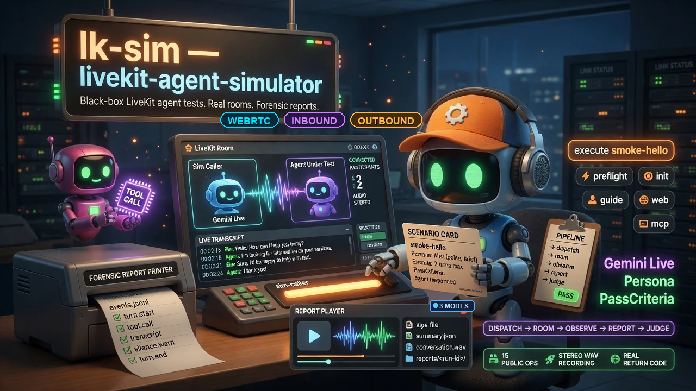

# livekit-agent-simulator

<div align="center">
  
</div>

<div align="center">


[](https://opensource.org/licenses/MIT)
[](https://github.com/quangdang46/livekit_agent_simulator/actions/workflows/ci.yml)
[](https://github.com/quangdang46/livekit_agent_simulator/releases)

</div>

**Dial any LiveKit voice agent with an AI simulated caller — WebRTC room, inbound SIP, or outbound SIP — and keep a full forensic log.**  
Standalone MCP server + CLI (`lks`). Black-box testing: no imports from the agent under test, no edits to its code or `.env`.

<div align="center">
<h3>Quick Install</h3>

```bash
curl -fsSL "https://raw.githubusercontent.com/quangdang46/livekit_agent_simulator/main/install.sh?$(date +%s)" \
  | bash -s -- --verify
```

</div>

### Install via coding agent (copy-paste)

Paste into Claude Code, Cursor, Codex, AmpCode, Windsurf, or any coding agent **from the repo you want to test**:

```text
Install and configure livekit-agent-simulator (CLI: lks) for this project by following the instructions here:
https://raw.githubusercontent.com/quangdang46/livekit_agent_simulator/main/docs/guide/installation.md

Target project root is this workspace. Use absolute --root paths. Install the portable CLI if missing, run lks init, help fill .agent-sim/config.yaml from my local env or ask me for LiveKit + active caller provider key (Gemini Live or OpenAI Realtime) + agent_name, ensure .agent-sim is gitignored, run preflight, and stop before execute if the voice agent worker is not running. Do not edit agent application source outside .agent-sim/.
```

Same idea, one line:

```text
Install and configure livekit-agent-simulator by following: https://raw.githubusercontent.com/quangdang46/livekit_agent_simulator/main/docs/guide/installation.md
```

---

## TL;DR

### The Problem

Voice agents fail in ways unit tests never see:

| Gap | What you miss |
|-----|----------------|
| No real caller | Scripts that never interrupt, stall, or switch language |
| Chat-only evals | No room events, audio timing, or tool spans |
| Manual QA calls | Not CI-reproducible, no structured PassCriteria |
| Agent-coupled harnesses | Tests break when you refactor the worker |

### The Solution

**livekit-agent-simulator** drives an AI simulated caller — Gemini Live or OpenAI Realtime (per `simulator.provider`) — from scenario JSONL over one of three transport modes (`Caller.mode`), observes transcripts / tools / flow / room events, and writes a timestamped report you can play back.

| Surface | What you get |
|---------|--------------|
| `lks` CLI | init → preflight → execute → report → web |
| MCP server | Same ops for Claude Code, Cursor, Codex, … |
| Transport modes | `webrtc_sim` · `inbound_sip` · `outbound_human_pickup` · `outbound_sim_callee` (optional `agent_dials`) |
| Reports | `events.jsonl`, `timeline.md`, `summary.json`, optional stereo WAV |
| Judge | Optional LLM PassCriteria scoring |

### Why Use lks?

| Feature | What it does |
|---------|--------------|
| **Black-box dispatch** | Only needs `agent_name` + LiveKit creds |
| **5 transport modes** | WebRTC · inbound SIP · outbound human pickup · outbound sim callee · agent_dials |
| **Scenario JSONL** | Persona, Caller, Telephony, Execute, Script, PassCriteria, Dispatch |
| **Forensic log** | Per-turn events in SQLite + `reports/<run-id>/` |
| **Report player** | Local web UI: audio + transcript sync |
| **CLI ↔ MCP parity** | One `ops` layer — no duplicate run paths |
| **Portable packs** | Download installer; no uv/pip required for users |

---

### Quick Example

```bash
# Install once
curl -fsSL "https://raw.githubusercontent.com/quangdang46/livekit_agent_simulator/main/install.sh?$(date +%s)" \
  | bash -s -- --verify

# In the repo you want to test (agent worker must already be running)
lks init --root /path/to/target
# edit /path/to/target/.agent-sim/config.yaml  (LiveKit + active provider keys, agent_name)

lks preflight --root /path/to/target
lks execute smoke-hello --root /path/to/target
lks report <run-id> --root /path/to/target
lks web --root /path/to/target          # Ctrl+C to stop
```

---

## Design Philosophy

1. **The agent under test is a black box.**  
   We never import or patch target application code. Dispatch metadata is opaque JSON.

2. **Generic core, target-owned config.**  
   Language, timezone, topics, and business strings belong in the target’s `.agent-sim/` — not hardcoded in the package.

3. **One ops layer for CLI and MCP.**  
   `execute_*` validates then runs. No “run vs execute” forks.

4. **Forensics over vibes.**  
   Every run produces structured events you can `compare`, `log`, and play back.

5. **CI-friendly gates.**  
   Hard fails on status / assert / script; optional strict judge for softer LLM scoring.

---

## How It Works

```text
1. Read <target>/.agent-sim/config.yaml
2. Pick SimLeg from scenario Caller.mode (webrtc_sim | inbound_sip | outbound_human_pickup | outbound_sim_callee | agent_dials)
3. Connect leg → LiveKit room(s) / SIP hairpin as needed; the active caller provider (Gemini Live / OpenAI Realtime) stays WebRTC in the sim room
4. Bridge audio; observe transcripts, tools, timing, interruptions
5. Write reports/<run-id>/ + runs.sqlite
6. Optional LLM judge vs PassCriteria
```

```text
                    Caller.mode (scenario)
         ┌───────────────┬────────────────┬──────────────────┬────────────────────┐
         │  webrtc_sim   │  inbound_sip   │   outbound_human_pickup   │ outbound_sim_callee│
         │  room audio   │  sim dials DID │ human answers → │  Gemini SIP callee │
         │               │                │ Gemini colocated│  (2-room hairpin)  │
         └───────┬───────┴────────┬───────┴────────┬─────────┴─────────┬──────────┘
                 │                │                │                   │
                 └────────────────┼────────────────┼───────────────────┘
                                  ▼
                    ┌──────────────────────────┐
                    │  Sim caller persona      │
                    │  (Gemini Live / OpenAI   │
                    │   Realtime) + LiveKit    │
                    │   agent (black box)      │
                    └────────────┬─────────────┘
                                 │ observe
                                 ▼
                    reports/<run-id>/ · runs.sqlite · judge
```

Mode details and config: [docs/telephony.md](docs/telephony.md). Templates: `inbound-caller-sim`, `outbound-human-pickup`, `outbound-callee-sim`.

---

## How lks Compares

| Approach | Real room | AI caller | Forensic log | MCP | Black-box |
|----------|-----------|-----------|--------------|-----|-----------|
| Manual phone QA | ✅ | ❌ | ❌ | ❌ | ✅ |
| Unit / mock STT | ❌ | ❌ | Partial | ❌ | ❌ |
| In-repo agent tests | ⚠️ | ⚠️ | Varies | ❌ | Often coupled |
| **lks** | ✅ LiveKit | ✅ Gemini Live / OpenAI Realtime | ✅ Full | ✅ | ✅ |

**When to use lks:**
- Regression suites for LiveKit voice agents
- Agent-driven CI / coding-agent workflows (MCP)
- Debugging turn-taking, tools, and silence without reading agent source

**When it might not be ideal:**
- Pure text chatbots with no LiveKit room
- Offline environments without LiveKit + an active caller provider API (Gemini Live or OpenAI Realtime)

---

## Installation

### Quick install (recommended)

**Download only — no uv/pip/build on your machine.** CI ships a portable pack (embedded Python + deps + report player).

```bash
# macOS / Linux
curl -fsSL "https://raw.githubusercontent.com/quangdang46/livekit_agent_simulator/main/install.sh?$(date +%s)" \
  | bash -s -- --verify
```

```powershell
# Windows PowerShell
irm "https://raw.githubusercontent.com/quangdang46/livekit_agent_simulator/main/install.ps1" -OutFile "$env:TEMP\lks-install.ps1"
powershell -NoProfile -ExecutionPolicy Bypass -File "$env:TEMP\lks-install.ps1" -Verify
```

Also available from a release asset:

```bash
curl -fsSL "https://github.com/quangdang46/livekit_agent_simulator/releases/download/v0.1.0/install.sh" \
  | bash -s -- --verify
```

| Flag | Purpose |
|------|---------|
| `--verify` | Checksum verification |
| `--ref v0.1.0` | Pin release tag |
| `--no-mcp` | Skip MCP registration into coding tools |
| `--uninstall` | Remove install |

By default the installer registers the MCP server `livekit-agent-simulator` (`lks mcp`) into detected tools: Claude Code, Cursor, Cline, Windsurf, VS Code Copilot, Gemini CLI, Amazon Q, OpenCode, Codex, Warp.

**Agent-oriented install playbook (long form):** [docs/guide/installation.md](docs/guide/installation.md)  
Raw URL for paste into agents:  
`https://raw.githubusercontent.com/quangdang46/livekit_agent_simulator/main/docs/guide/installation.md`

### From source (maintainers / contributors)

```bash
git clone https://github.com/quangdang46/livekit_agent_simulator.git
cd livekit-agent-simulator
uv sync --extra dev
uv run lks --help
```

Requires **Python 3.10–3.13**.

### Web UI (maintainers)

Users never build this — CI packs `web/dist` into the wheel as `web_static`. Source: `web/`.

```bash
pnpm --dir web install
pnpm --dir web build                    # → web/dist/ (attached by Hatch on uv build)
pnpm --dir web dev                      # HMR; proxy /api + /runs → lks web :8765
```

See `web/README.md`.

---

### lksr — experimental Rust binary

`lksr` is the in-progress **Rust full port** of `lks` (single static-ish binary, no Python runtime). Source: `src/livekit_agent_simulator_rust/`. Same 22 CLI commands + MCP server + report player.

**Status:** data-plane ops (scenarios/validate/export/cues/plugins/runs/report/compare/optimize) and offline gates are at parity; the live-run path still has known gaps vs Python (script `speak` cues reach the room via the OpenAI bridge only, judge defaults to skip without `judge.base_url`, verify plugins need a build with `--features python-plugins`). For CI-critical runs use the Python `lks`; try `lksr` for quick local checks.

```bash
curl -fsSL "https://github.com/quangdang46/livekit_agent_simulator/raw/main/install-rust.sh" | bash -s -- --verify   # once a v*-rust release exists
cd src/livekit_agent_simulator_rust && cargo build -p lks && cargo test --workspace   # from source
```

---

## Quick Start

```bash
# Agent worker must be running and registered with LiveKit
lks guide
lks init --root /path/to/target
# fill .agent-sim/config.yaml

lks preflight --root /path/to/target
lks scenario-init smoke-hello --root /path/to/target   # if needed
lks validate smoke-hello --root /path/to/target
lks execute smoke-hello --root /path/to/target
lks runs --root /path/to/target
lks report <run-id> --root /path/to/target
lks web --root /path/to/target
```

### Minimal scenario (`smoke-hello`)

```yaml
apiVersion: agent-sim/v1
kind: Scenario
metadata:
  id: smoke-hello
  locale: en-US
  tags: [smoke]
persona:
  name: Alex
  brief: First-time caller; confirm you reached the right place, then end politely.
  goals:
  - Hear the agent
  - Say you will call back
  style: polite, brief
execute:
  max_turns: 2
  timeout_s: 90
  first_speaker: user
pass_criteria:
  criteria:
  - The agent responded to the caller
  - The agent responded in the caller's language
```

Optional multi-judge PassCriteria: `judges[]` + `mode` (`all` \| `majority` \| `any`). Assert highlights (`tool_order`, `constraint_respected`, recovery/latency): `lks guide`.

Full-line `#` comments in scaffolded YAML are guides — runtime ignores them. Legacy `*.jsonl` scenarios are still read.

---

## Configuration

Target-only data lives under `<target>/.agent-sim/` (**gitignored**). Created by `init`.

| Section | Required | Purpose |
|---------|----------|---------|
| `livekit.url` | yes | `wss://…` LiveKit Cloud or self-host |
| `livekit.api_key` / `api_secret` | yes | Server API credentials |
| `livekit.agent_name` | yes | Must match worker dispatch name |
| `livekit.dispatch_metadata` | no | Default opaque JSON **string** for all runs |
| `simulator.api_key` | yes | Key of the **active** caller provider (`google` → Gemini, `openai` → OpenAI) |
| `simulator.provider` / `mode` | no | Caller brain: `google` (default) or `openai`; `realtime` mode (cascade reserved) |
| `simulator.voice.model` / `voice` / `language` | no | Provider-neutral voice bag; defaults flash-live, Puck, `en-US` |
| `simulator.profiles` | no | **Named caller profiles** — switch provider without editing the file |
| `judge.model` | no | If set + PassCriteria → post-run LLM judge |
| `observe.record_audio` | no (default `true`) | Local stereo WAV (L=sim, R=agent); no Egress |
| `observe.data_topics` | no | Empty = all topics |
| `observe.tool_event_patterns` | no | Map data payloads → tool start/end/error |

See template: [`templates/config.yaml`](templates/config.yaml). Consumer-specific wiring: [`docs/portability.md`](docs/portability.md).

### Switching caller provider with `--profile`

To A/B test the same scenario against **Gemini Live** vs **OpenAI Realtime** (or
any set of provider/voice combos) **without editing `config.yaml` between runs**,
define named profiles under `simulator.profiles:` and select one with
`--profile <name>` on `execute` / `execute-all` / `preflight`.

```yaml
simulator:
  # legacy flat block = fallback (used when no --profile flag and no default profile)
  provider: google
  mode: realtime
  api_key: "AQ.Ab8..."                 # Gemini Live key

  # named profiles — switch with --profile <name>
  profiles:
    gemini:
      default: true                    # auto-selected when no --profile flag
      provider: google
      api_key: "AQ.Ab8..."             # Gemini Live key
    openai:
      provider: openai
      api_key: "sk-..."                # OpenAI key
      voice:
        model: "gpt-realtime-2.1-mini"
        voice: "marin"
```

```bash
lks execute smoke-hello                    # `gemini` (marked default: true)
lks execute smoke-hello --profile gemini   # Gemini Live caller
lks execute smoke-hello --profile openai   # OpenAI Realtime caller
```

**Selection** (`--profile` absent): if **exactly one** profile has
`default: true`, it is used; otherwise the legacy flat `simulator:` block runs.
2+ profiles marked `default: true` is an error (no "first wins"). If `profiles:`
exist with **no** default and **no** flat-block credentials, config loading
errors loudly (no silent fallback). `--profile <name>` always wins regardless
of which profile is default. A missing profile name fails loudly (lists
available profiles) — no silent fallback. Profile names are **case-sensitive**.

**Precedence:** profile field → flat `simulator:` field → built-in default. A
profile **inherits** unspecified fields (voice, language, mode) from the flat
block, so `openai` above only overrides `provider` + `api_key` + `voice`, and
keeps `mode: realtime`. Presence of `profiles:` never changes what runs when
neither `--profile` nor a `default: true` profile is present — that is the flat
block (backward compatible).

> **⚠️ Gemini caller model note (observed 2026-08):**
> `gemini-3.1-flash-live-preview` — the historical default — is a **preview** model with known instability as the simulated caller: transient mid-call WebSocket drops (`APIError 1006 / 1008`, end reason `gemini_socket_drop`) in ~2/15 real runs, plus LiveKit-documented limits (`send_client_content` rejected after the first model turn, `update_instructions`/`generate_reply` unsupported). If you see calls ending with `gemini_socket_drop`, switch the caller model to a stable release, e.g.:
> ```yaml
> simulator:
>   voice:
>     model: "gemini-2.5-flash-native-audio-preview-12-2025"   # or gemini-live-2.5-flash-native-audio (GA)
> ```
> Verified: `gemini-2.5-flash-native-audio-preview-12-2025` connects and talks as the caller with **0 socket drops** across real runs (the `-12-2025` date suffix is required — `gemini-2.5-flash-native-audio-preview` alone returns `API_KEY_INVALID`).

---

## Commands

CLI and MCP share the same public ops (`ops.py`). Prefer `execute` (validate then run).

| CLI | MCP tool | Purpose |
|-----|----------|---------|
| `init` | `init_project` | Scaffold `.agent-sim/` + gitignore |
| `guide` | `guide` | Setup/ops guide (markdown) |
| `web` | `web` | Local report player |
| `preflight` | `preflight` | Config + LiveKit connectivity |
| `scenarios` | `list_scenarios` | List `scenarios/*.yaml` (legacy `*.jsonl` read) |
| `plugins` | `list_plugins` | Verify plugins |
| `cues` | `list_cues` | Built-in + local PCM cues |
| `validate` | `validate_scenario` | Schema + lint |
| `export` | `export_scenario` | Parsed scenario JSON |
| `scenario-init` | `init_scenario` | Scaffold JSONL with `//` guides |
| `execute` | `execute_scenario` | Validate then run one scenario |
| `execute-all` | `execute_scenarios` | Batch (ids / tag) |
| `execute-dict` | `execute_scenario_dict` | In-memory scenario dict |
| `status` | `get_run_status` | SQLite run status |
| `log` | `get_run_log` | Filtered `events.jsonl` |
| `report` | `get_run_report` | Summary + verdict + paths |
| `compare` | `compare_runs` | Diff two runs; `--baseline` hard-fails on latency/assert / barge-recovery regression |
| `runs` | `list_runs` | Run history |
| `serve` | — | REST API (JSON over HTTP; same ops as CLI/MCP) |
| `optimize` | `optimize_persona` | Offline persona-prompt optimizer (live benchmark loop) → `.agent-sim/optimized/` artifact |
| `mcp` | — | Start MCP server (stdio) |

```bash
lks execute smoke-hello --root /path/to/target
lks execute-all --tag smoke --root /path/to/target
lks serve --root /path/to/target    # REST API on :8787 (same ops as CLI/MCP)
lks log <run-id> --root /path/to/target
lks compare <run-a> <run-b> --root /path/to/target
lks compare <baseline> <candidate> --baseline --root /path/to/target
lks optimize scen-a,scen-b --held-out scen-c --root /path/to/target   # → optimized/<name>/
lks execute scen-a --optimized <name> --root /path/to/target           # apply the winner
lks web --port 8765 --root /path/to/target
```

Every MCP tool needs `project_root` **except** `guide`.

### Output format

List/table-shaped commands (`scenarios`, `runs`, `plugins`, `cues`, `validate`,
`preflight`, `execute`, `execute-all`, `execute-dict`, `compare`, `status`,
`report`, `log`) print a **human-readable rich table** by default. Add
`--json` to any of them for the raw machine-readable payload — the same bytes
the MCP tools return. Single-dict commands (`init`, `export`, `convert`,
`scenario-init`, `scenario-from-run`, `guide`, `web`) always print JSON.

```bash
lks scenarios                          # human table
lks scenarios --json                   # raw JSON for scripts / CI / agents
lks execute-all --json | jq '.suite'   # pipe JSON to jq
```

**Agents & CI:** use `--json` — the default table is for humans.

### MCP config examples

Installer writes this when tools are detected. Manual Cursor:

```json
{
  "mcpServers": {
    "livekit-agent-simulator": {
      "command": "lks",
      "args": ["mcp"],
      "env": {}
    }
  }
}
```

Dev checkout (package not installed globally):

```json
{
  "mcpServers": {
    "livekit-agent-simulator": {
      "command": "uv",
      "args": ["run", "--directory", "/abs/path/livekit-agent-simulator", "lks", "mcp"]
    }
  }
}
```

Equivalent one-shot entry: `lks-mcp` (same process as `lks mcp`).

---

## Architecture

```text
src/livekit_agent_simulator/
├── cli.py / mcp_server.py     # thin surfaces
├── ops.py                     # shared public ops
├── run_orchestrator.py        # room lifecycle + run
├── scenario.py                # JSONL parse / validate
├── config.py                  # .agent-sim/config.yaml
├── preflight.py
├── asserts.py / suite.py      # CI gates
├── callers/                   # Live caller (gemini / openai)
├── livekit/                   # room, dispatch, observe
├── audio/ · script/ · plugins/
└── web/                       # report player server
```

| Layer | Role |
|-------|------|
| Target `.agent-sim/` | Config, scenarios, reports, local plugins/cues |
| Package `templates/` | Scaffold defaults + built-in cues |
| LiveKit | Room, dispatch, data topics, transcription |
| Caller provider (Gemini Live / OpenAI Realtime) | Simulated caller voice (+ optional judge) |

---

## CI / Release

| Workflow | Trigger | What it does |
|----------|---------|--------------|
| [CI](.github/workflows/ci.yml) | PR / push → `main` | web UI build, `pytest` (3.10 + 3.12), `lks --help` |
| [Release](.github/workflows/release.yml) | tag `v*` | pytest → wheel → portable packs (win/linux/mac) → GitHub Release |

```bash
# Local check
uv sync --extra dev
pnpm --dir web build
uv run pytest -q

# Release (pre-1.0 may force-retag a single 0.1.0)
git tag v0.1.0
git push origin v0.1.0
```

---

## Troubleshooting

### `preflight` fails connectivity

```bash
lks preflight --root /path/to/target
# Confirm livekit.url / api_key / api_secret and that the project is reachable.
# Skip API check while editing config:
lks preflight --no-connectivity --root /path/to/target
```

### Agent never joins the room

- Worker process must be **running** and registered with the same `livekit.agent_name`.
- Increase `livekit.agent_join_timeout_ms` if cold start is slow.
- Check dispatch metadata is valid JSON **string** if your worker requires it.

### Simulator / caller-provider auth errors

Set `simulator.api_key` in `.agent-sim/config.yaml` for the active `simulator.provider` (`google` → Gemini Live, `openai` → OpenAI Realtime).

### No audio in report player

With `observe.record_audio` enabled (default `true`): `reports/<run-id>/conversation.wav`

```bash
lks web --root /path/to/target
```

### MCP tools not listed

```bash
lks mcp   # must be what the host launches
# or reinstall without --no-mcp
curl -fsSL "https://raw.githubusercontent.com/quangdang46/livekit_agent_simulator/main/install.sh?$(date +%s)" \
  | bash -s -- --verify
```

### Scenario validation errors

```bash
lks validate my-case --root /path/to/target
lks scenario-init my-case --root /path/to/target   # fresh scaffold with // guides
```

---

## Limitations

### What lks Doesn't Do (Yet)

- **Not an agent framework** — it tests agents; it does not implement business tools
- **Not offline-first** — needs LiveKit + an active caller-provider API (Gemini Live or OpenAI Realtime)
- **Not a load generator** — one simulated caller per run (batch via `execute-all`)

### Known Limitations

| Capability | Current state | Notes |
|------------|---------------|-------|
| Black-box dispatch | ✅ | Opaque metadata only |
| Multi-caller rooms | ❌ | Single sim participant |
| Caller backends | ✅ | Gemini Live and OpenAI Realtime are supported paths (per `simulator.provider`) |
| Pixel-perfect ASR scoring | ❌ | Use PassCriteria + judge / asserts |
| Secrets in config | ⚠️ Paste in gitignored YAML | Do not commit `.agent-sim/` |

---

## FAQ

### Does it modify my agent repo?

Only scaffolds **`.agent-sim/`** (gitignored). It does not edit agent source.

### CLI vs MCP — which should I use?

Same ops. Use CLI in terminals/CI; MCP inside coding agents. Prefer `execute_*` over ad-hoc run paths.

### How do I pass project-specific dispatch fields?

`livekit.dispatch_metadata` or scenario `Dispatch.spec.metadata` as an opaque JSON string. Core does not parse consumer keys. See [`docs/portability.md`](docs/portability.md).

### Can I assert on tool calls?

Yes — `Assert.spec.tools`, **`tool_order`** (required `tool.start` subsequence), `observe.tool_event_patterns`, Script/assert plugins, and/or PassCriteria + judge. See [`docs/plugins.md`](docs/plugins.md) and `lks guide`.

### Where are reports stored?

`<target>/.agent-sim/reports/<run-id>/` plus `runs.sqlite` under `.agent-sim/`.

### Is the report player separate?

No — `lks web` serves the prebuilt player from the install pack. Maintainers build from `web/`.

---

## Docs

| Doc | When |
|-----|------|
| [AGENTS.md](AGENTS.md) | Rules for AI agents working on this package |
| [docs/smoke-test.md](docs/smoke-test.md) | First end-to-end run |
| [docs/portability.md](docs/portability.md) | Consumer dispatch / observe setup |
| [docs/plugins.md](docs/plugins.md) | Verify plugins + Python API |
| [docs/telephony.md](docs/telephony.md) | SIP modes + outbound_sim_callee preflight |
| [docs/interrupt-scenario-matrix.md](docs/interrupt-scenario-matrix.md) | Barge / backchannel / noise authoring |
| `lks guide` | On-demand setup/ops guide (Assert, compare --baseline, PassCriteria) |

---

## About Contributions

Please don't take this the wrong way, but I do not accept outside contributions for any of my projects. I simply don't have the mental bandwidth to review anything, and it's my name on the thing, so I'm responsible for any problems it causes; thus, the risk-reward is highly asymmetric from my perspective. I'd also have to worry about other "stakeholders," which seems unwise for tools I mostly make for myself for free. Feel free to submit issues, and even PRs if you want to illustrate a proposed fix, but know I won't merge them directly. Instead, I'll have Claude or Codex review submissions via `gh` and independently decide whether and how to address them. Bug reports in particular are welcome. Sorry if this offends, but I want to avoid wasted time and hurt feelings. I understand this isn't in sync with the prevailing open-source ethos that seeks community contributions, but it's the only way I can move at this velocity and keep my sanity.

---

## License

[MIT](./LICENSE)

---

<div align="center">

**Black-box LiveKit agent tests. Real rooms. Forensic reports.**

</div>
